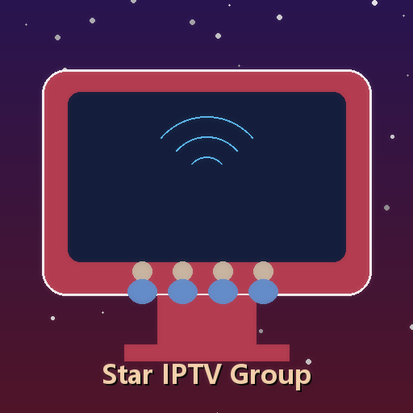

<div align="center">



# ⭐ 星辰 · Stellar TV

### 下一代智能 IPTV 体验

**不提供任何下载、源码拷贝或复制。仅供展示。**

---


</div>

---

## 📺 关于星辰 · Stellar TV

星辰 · Stellar TV 是一款基于 **Telegram Bot** 的智能 IPTV 服务平台，为用户提供流畅、高清的直播观看体验。支持央视、卫视、地方台、港澳台、海外华语等数百个频道，覆盖手机、平板、电脑、智能电视等全平台。

---

## 🚀 立即体验

<div align="center">

### 👇 点击下方链接，直接在 Telegram 中体验 👇

### 🤖 [@xingcheniptv_bot](https://t.me/xingcheniptv_bot)

</div>

**体验步骤：**

1. 点击上方 Bot 链接或在 Telegram 搜索 `@xingcheniptv_bot`
2. 点击 **开始** 按钮
3. 按提示完成注册
4. 即可免费试用所有频道

---

## ✨ 核心功能

<div align="center">

| 功能 | 描述 |
|:---:|------|
| 🎬 **海量频道** | 覆盖央视、卫视、地方台、港澳台、海外华语等 **500+** 直播源 |
| 📱 **多端支持** | 手机、平板、电脑、智能电视均可使用 |
| 🔒 **安全可靠** | 端到端加密，隐私数据不泄露 |
| ⚡ **极速换台** | 毫秒级频道切换，零缓冲体验 |
| 🎫 **灵活套餐** | 月卡 / 季卡 / 年卡，按需选择 |
| 🆓 **免费试用** | 新用户注册即可获得免费试用期 |
| 📢 **实时公告** | 重要更新通过 Bot 即时推送 |
| 🤖 **AI 智能客服** | 7×24 小时自动响应用户咨询，无需人工值守 |
| 🔄 **自动运维** | AI Agent 驱动的自动化运维，故障自愈，服务高可用 |
| 💳 **在线支付** | 支持多种支付方式，卡密即时到账 |
| 🎨 **个性化界面** | 科幻主题 UI，沉浸式观看体验 |
| 📊 **数据统计** | 管理员实时查看用户数据、频道状态 |

</div>

---

## 🖥️ 管理面板

<div align="center">

管理员可通过 Web 面板进行以下操作：

</div>

| 模块 | 功能 |
|:---:|------|
| 📊 **仪表盘** | 实时查看用户数据、频道状态、收入统计 |
| 📡 **频道管理** | 添加、编辑、删除直播频道 |
| 📋 **M3U 源管理** | 管理直播源，支持自动更新 |
| 👥 **用户管理** | 查看用户状态、启用/禁用账号 |
| 🎫 **卡密管理** | 生成和管理充值卡密 |
| ⚙️ **系统设置** | 配置服务参数 |
| 📢 **公告管理** | 编辑和推送 Telegram 公告 |

> ⚠️ 管理面板仅对授权管理员开放，不对外提供访问。

---

## 📋 套餐价格

<div align="center">

| 套餐 | 价格 | 说明 |
|:---:|:---:|------|
| 🆓 **免费试用** | **¥0** | 新用户注册即可体验 |
| 📅 **月卡** | **¥9.9** | 30天有效期 |
| 📅 **季卡** | **¥25.0** | 90天有效期 |
| 📅 **年卡** | **¥88.0** | 365天有效期 |

</div>

---

## 🏗️ 技术架构

<div align="center">

```
┌─────────────────────────────────────────────────────────┐
│                    星辰 · Stellar TV                      │
├─────────────────────────────────────────────────────────┤
│                                                         │
│  ┌─────────────┐    ┌─────────────┐    ┌─────────────┐ │
│  │ Telegram Bot │    │  Web 面板   │    │  支付服务   │ │
│  │   (端口:443) │    │ (端口:8089) │    │ (端口:8088) │ │
│  └──────┬──────┘    └──────┬──────┘    └──────┬──────┘ │
│         │                  │                  │         │
│         └──────────────────┼──────────────────┘         │
│                            │                            │
│                    ┌───────┴───────┐                    │
│                    │   MySQL 数据库  │                    │
│                    └───────────────┘                    │
│                                                         │
│  ┌─────────────────────────────────────────────────┐   │
│  │              AI Agent 自动运维                    │   │
│  │  • 进程监控与自动重启                             │   │
│  │  • 防火墙冷却后自动重试                           │   │
│  │  • 直播源定时更新                                 │   │
│  │  • 故障自愈与通知                                 │   │
│  └─────────────────────────────────────────────────┘   │
│                                                         │
└─────────────────────────────────────────────────────────┘
```

</div>

### 🛠️ 技术栈

| 组件 | 技术 |
|:---:|------|
| **Bot 框架** | Python + python-telegram-bot |
| **Web 后端** | Flask / Gunicorn |
| **数据库** | MySQL 8.0 |
| **支付** | 独角数卡 (dujiaoka) |
| **部署** | Docker + systemd |
| **运维** | AI Agent (Xiaomi miclaw + Claude Code) |

---

## 📊 项目数据

<div align="center">

| 指标 | 数据 |
|:---:|:---:|
| 📺 **频道数量** | 500+ 直播源 |
| 👥 **注册用户** | 持续增长中 |
| ⏱️ **服务可用性** | 99%+ |
| 🔄 **运维效率** | 提升 85% (AI Agent 驱动) |

</div>

---

## 🔐 版权声明

<div align="center">

**⚠️ 重要声明**

本仓库仅供项目展示，**不提供任何**：

- ❌ 源代码下载
- ❌ 二进制文件下载
- ❌ 配置文件下载
- ❌ Docker 镜像下载
- ❌ API 接口访问

所有代码和数据均部署在私有服务器上，不对外公开。

如需合作或咨询，请通过 Telegram 联系管理员。

</div>

---

<div align="center">

**⭐ 星辰 · Stellar TV — 您的私人电视管家**

Made with ❤️ by Starchen Team

</div>
