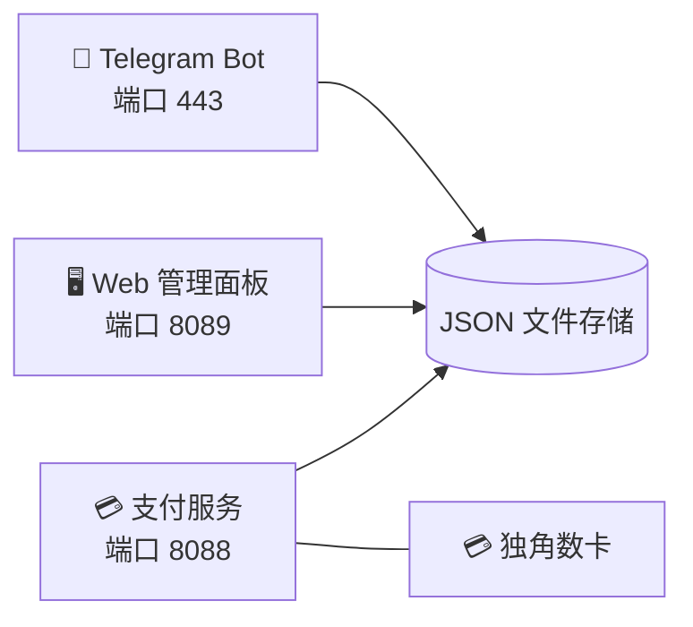

 

# ⭐ 星辰 · Stellar TV

### 📺 下一代智能 IPTV 影视直播平台

 

 

**[🇨🇳 中文](README.md) · [🇺🇸 English](README_EN.md) · [🇹🇼 繁體中文](README_TW.md) · [🇯🇵 日本語](README_JA.md) · [🇰🇷 한국어](README_KO.md)**

 

> ⚠️ 本仓库仅供项目展示，**不提供任何下载、源码拷贝或复制**。

---

## 🚀 立即体验

### 👇 点击下方按钮，直接在 Telegram 中开启 👇

### 🤖 [@xingcheniptv_bot](https://t.me/xingcheniptv_bot)

 

| 步骤 | 操作 |
|:---:|------|
| **①** | 点击上方链接或在 Telegram 搜索 `@xingcheniptv_bot` |
| **②** | 点击 **开始** 按钮 |
| **③** | 按提示完成注册 |
| **④** | 即可获取自己的专属播放地址 |

---

## 📺 关于星辰 · Stellar TV

星辰 · Stellar TV 是一款基于 **Telegram Bot** 的智能 IPTV 影视直播平台，为用户提供流畅、高清的直播观看体验。

**覆盖内容：** 央视 · 卫视 · 地方台 · 港澳台 · 海外华语 · 体育 · 新闻 · 娱乐

**支持平台：** 📱 手机 · 📱 平板 · 💻 电脑 · 📺 智能电视

---

## ✨ Bot 功能一览

| 功能 | 说明 |
|:---:|------|
| 📺 **播放地址** | 一键获取专属播放地址，支持复制到任意播放器使用 |
| 👤 **我的信息** | 查看账号状态、剩余天数、到期时间 |
| 💰 **购买套餐** | 月卡 / 季卡 / 年卡，灵活选择，即时生效 |
| 🎫 **使用兑换卡** | 输入卡密即可激活套餐 |
| 📢 **源失效上报** | 频道无法播放时一键上报，快速修复 |
| 👥 **加入群组** | 加入官方 Telegram 群组，获取最新动态和帮助 |
| 📖 **使用教程** | 详细的图文教程，新手也能快速上手 |
| 🌐 **网页面板** | 网页端管理面板，查看订单和账户信息 |
| ❓ **使用帮助** | 常见问题解答，遇到问题随时查看 |

---

## 🖥️ 管理面板

管理员可通过 Web 面板进行以下操作：

| 模块 | 功能 |
|:---:|------|
| 📊 **仪表盘** | 实时查看用户数据、频道状态、收入统计 |
| 📡 **频道管理** | 添加、编辑、删除直播频道 |
| 📋 **M3U 源** | 管理直播源，支持自动更新 |
| ❤️ **源监控** | 监控直播源可用性和状态 |
| 👥 **用户管理** | 查看用户状态、启用/禁用账号 |
| 🎫 **兑换卡** | 生成和管理兑换卡密 |
| 📢 **公告管理** | 编辑和推送 Telegram 公告 |
| 📋 **订单管理** | 查看和管理用户订单 |
| 📊 **数据统计** | 分组统计、数据分析报表 |
| ⚙️ **系统设置** | 配置服务参数 |

> ⚠️ 管理面板仅对授权管理员开放，不对外提供访问。

---

## 📋 更新日志

| 版本 | 日期 | 更新内容 |
|:---:|:---:|------|
| **v2.1** | 2026-05-11 | 🔧 修复订单管理数据结构 · 📊 修复数据统计模块 · 🎨 优化分组统计界面（M3U覆盖率带颜色、兑换码蓝绿背景）· 📋 侧边栏用户管理/M3U源位置对调 · 📝 后台模块列表同步实际侧边栏（新增源监控、订单管理、数据统计）|
| **v2.0** | 2026-05-08 | ✨ 后台管理面板全面重写 |
| **v1.0** | 2026-05-07 | 🚀 首次部署上线 |

---

## 📋 套餐价格

| 套餐 | 价格 | 说明 |
|:---:|:---:|------|
| 🆓 **免费试用** | **¥0** | 新用户注册即可体验，3天有效期 |
| 📅 **月卡** | **¥9.9** | 30天有效期 |
| 📅 **季卡** | **¥25.0** | 90天有效期 |
| 📅 **年卡** | **¥88.0** | 365天有效期 |

---

## 🏗️ 技术架构

### 🛠️ 技术栈

| 组件 | 技术 |
|:---:|------|
| **Bot 框架** | Python 3.12 + python-telegram-bot |
| **Web 后端** | Flask / Gunicorn |
| **数据存储** | JSON 文件 |
| **支付** | 独角数卡 (dujiaoka) |
| **部署** | Docker + systemd |
| **服务器** | Ubuntu 24.04 · RackNerd VPS · 4GB RAM |

---

## 📊 项目数据

| 📺 频道数量 | 📁 频道分组 | ⏱️ 服务状态 | 🤖 AI 运维 |
|:---:|:---:|:---:|:---:|
| 6,346 个直播源 | 100+ 个分组 | 三个服务运行中 | Xiaomi miclaw 全自动管理 |

### 📡 频道分组统计（Top 15）

| 分组 | 数量 | 分组 | 数量 |
|:---:|:---:|:---:|:---:|
| 📰 News | 800 | 🎵 Music | 595 |
| 🎭 Entertainment | 562 | 🎬 Movies | 357 |
| ⚽ Sports | 295 | 📡 卫视 | 172 |
| 📚 Education | 192 | 🧒 Kids | 167 |
| ☘️ 浙江 | 144 | 🌍 Documentary | 112 |
| 📺 央视 | 109 | 🎭 Culture | 104 |
| 🎬 电影 | 84 | 🏀 体育 | 76 |
| 🌊 港·澳·台 | 50 | | |

---

## 🔐 版权声明

> ⚠️ **重要声明**
>
> 本仓库仅供项目展示，**不提供任何**：
>
> - ❌ 源代码下载
> - ❌ 二进制文件下载
> - ❌ 配置文件下载
> - ❌ Docker 镜像下载
> - ❌ API 接口访问
>
> 所有代码和数据均部署在私有服务器上，不对外公开。
>
> 如需合作或咨询，请通过 Telegram 联系管理员。

---

**⭐ 星辰 · Stellar TV — 您的私人电视管家**

Made with ❤️ by Starchen Team

