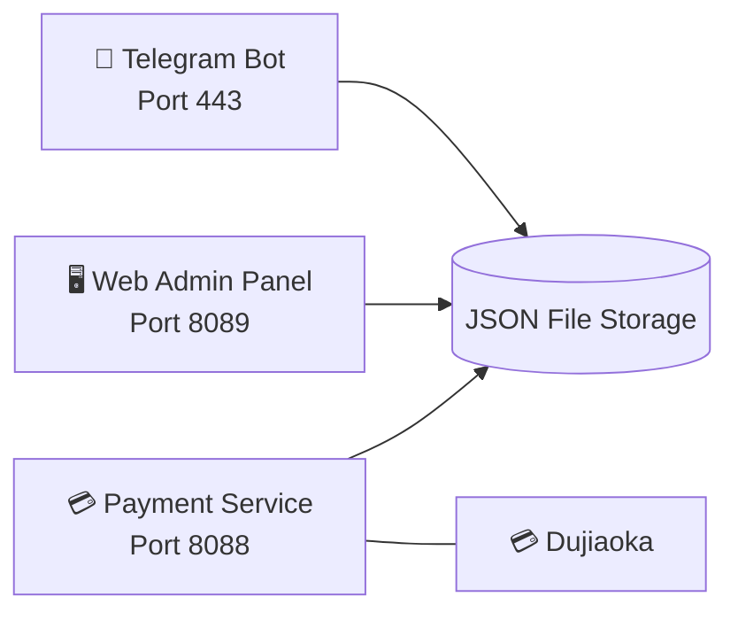

 

# ⭐ Stellar TV

### 📺 Next-Gen Smart IPTV Live Streaming Platform

 

 

**[🇨🇳 中文](README.md) · [🇺🇸 English](README_EN.md) · [🇹🇼 繁體中文](README_TW.md) · [🇯🇵 日本語](README_JA.md) · [🇰🇷 한국어](README_KO.md)**

 

> ⚠️ This repository is for showcase only. **No downloads, source code, or copying available.**

---

## 🚀 Try It Now

### 👇 Click the button below to start in Telegram 👇

### 🤖 [@xingcheniptv_bot](https://t.me/xingcheniptv_bot)

 

| Step | Action |
|:---:|------|
| **①** | Click the link above or search `@xingcheniptv_bot` in Telegram |
| **②** | Click the **Start** button |
| **③** | Follow the prompts to complete registration |
| **④** | Get your exclusive playback URL |

---

## 📺 About Stellar TV

Stellar TV is an intelligent IPTV live streaming platform based on **Telegram Bot**, providing users with a smooth and high-definition live TV experience.

**Content Coverage:** CCTV · Satellite TV · Local Stations · HK/Macau/Taiwan · Overseas Chinese · Sports · News · Entertainment

**Supported Platforms:** 📱 Phone · 📱 Tablet · 💻 Computer · 📺 Smart TV

---

## ✨ Bot Features

| Feature | Description |
|:---:|------|
| 📺 **Playback URL** | One-click access to your exclusive playback URL, works with any player |
| 👤 **My Info** | Check account status, remaining days, and expiration date |
| 💰 **Purchase Plan** | Monthly / Quarterly / Annual, flexible options with instant activation |
| 🎫 **Redeem Card** | Enter your card code to activate a subscription |
| 📢 **Report Source** | One-click report when a channel is unavailable, fast repair |
| 👥 **Join Group** | Join the official Telegram group for updates and support |
| 📖 **Tutorial** | Detailed step-by-step guide, easy for beginners |
| 🌐 **Web Panel** | Web-based management panel for orders and account info |
| ❓ **Help** | FAQ and troubleshooting, get help anytime |

---

## 🖥️ Admin Panel

Admins can perform the following operations through the web panel:

| Module | Function |
|:---:|------|
| 📊 **Dashboard** | Real-time user data, channel status, revenue statistics |
| 📡 **Channel Management** | Add, edit, delete live channels |
| 📋 **M3U Sources** | Manage live sources with auto-update support |
| ❤️ **Source Monitor** | Monitor live source availability and status |
| 👥 **User Management** | View user status, enable/disable accounts |
| 🎫 **Redemption Codes** | Generate and manage redemption codes |
| 📢 **Announcements** | Edit and push Telegram announcements |
| 📋 **Order Management** | View and manage user orders |
| 📊 **Data Statistics** | Group statistics, data analysis reports |
| ⚙️ **System Settings** | Configure service parameters |

> ⚠️ Admin panel is only available to authorized administrators, not publicly accessible.

---

## 📋 Changelog

| Version | Date | Updates |
|:---:|:---:|------|
| **v2.1** | 2026-05-11 | 🔧 Fix order management data structure · 📊 Fix data statistics module · 🎨 Optimize group statistics UI (M3U coverage with colors, redemption code blue-green background) · 📋 Swap sidebar positions of User Management / M3U Sources |
| **v2.0** | 2026-05-08 | ✨ Full admin panel rewrite |
| **v1.0** | 2026-05-07 | 🚀 Initial deployment |

---

## 📋 Pricing Plans

| Plan | Price | Description |
|:---:|:---:|------|
| 🆓 **Free Trial** | **¥0** | 3-day trial upon new user registration |
| 📅 **Monthly** | **¥9.9** | 30-day validity |
| 📅 **Quarterly** | **¥25.0** | 90-day validity |
| 📅 **Annual** | **¥88.0** | 365-day validity |

---

## 🏗️ Technical Architecture

### 🛠️ Tech Stack

| Component | Technology |
|:---:|------|
| **Bot Framework** | Python 3.12 + python-telegram-bot |
| **Web Backend** | Flask / Gunicorn |
| **Data Storage** | JSON Files |
| **Payment** | Dujiaoka |
| **Deployment** | Docker + systemd |
| **Server** | Ubuntu 24.04 · RackNerd VPS · 4GB RAM |

---

## 📊 Project Data

| 📺 Channels | 📁 Groups | ⏱️ Status | 🤖 AI Ops |
|:---:|:---:|:---:|:---:|
| 6,346 live sources | 100+ groups | All 3 services running | Xiaomi miclaw |

### 📡 Channel Group Stats (Top 15)

| Group | Count | Group | Count |
|:---:|:---:|:---:|:---:|
| 📰 News | 800 | 🎵 Music | 595 |
| 🎭 Entertainment | 562 | 🎬 Movies | 357 |
| ⚽ Sports | 295 | 📡 Satellite | 172 |
| 📚 Education | 192 | 🧒 Kids | 167 |
| ☘️ Zhejiang | 144 | 🌍 Documentary | 112 |
| 📺 CCTV | 109 | 🎭 Culture | 104 |
| 🎬 Movies | 84 | 🏀 Sports | 76 |
| 🌊 HK·MO·TW | 50 | | |

---

## 🔐 Copyright Notice

> ⚠️ **Important Disclaimer**
>
> This repository is for showcase only. **No**:
>
> - ❌ Source code downloads
> - ❌ Binary file downloads
> - ❌ Configuration file downloads
> - ❌ Docker image downloads
> - ❌ API access
>
> All code and data are deployed on private servers and not publicly available.
>
> For cooperation or inquiries, please contact the admin via Telegram.

---

**⭐ Stellar TV — Your Personal TV Butler**

Made with ❤️ by Starchen Team

