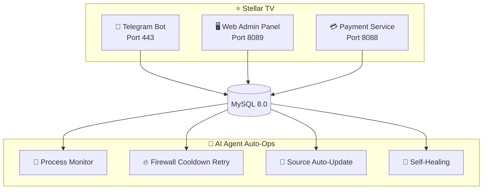

 

# ⭐ Stellar TV

### 📺 Next-Gen Smart IPTV Live Streaming Platform

 

 

**[🇨🇳 中文](README.md) · [🇺🇸 English](README_EN.md)**

 

> ⚠️ This repository is for showcase only. **No downloads, source code, or copying available.**

---

## 🚀 Try It Now

### 👇 Click the button below to start in Telegram 👇

### 🤖 [@xingcheniptv_bot](https://t.me/xingcheniptv_bot)

 

| Step | Action |
|:---:|------|
| **①** | Click the link above or search `@xingcheniptv_bot` in Telegram |
| **②** | Click the **Start** button |
| **③** | Follow the prompts to complete registration |
| **④** | Get your exclusive playback URL |

---

## 📺 About Stellar TV

Stellar TV is an intelligent IPTV live streaming platform based on **Telegram Bot**, providing users with a smooth and high-definition live TV experience.

**Content Coverage:** CCTV · Satellite TV · Local Stations · HK/Macau/Taiwan · Overseas Chinese · Sports · News · Entertainment

**Supported Platforms:** 📱 Phone · 📱 Tablet · 💻 Computer · 📺 Smart TV

---

## ✨ Core Features

| Feature | Description |
|:---:|------|
| 🎬 **Massive Channels** | **500+** live sources covering CCTV, satellite TV, local stations, HK/Macau/Taiwan, overseas Chinese |
| 📱 **Multi-Platform** | Works on phones, tablets, computers, and smart TVs |
| 🔒 **Secure & Reliable** | End-to-end encryption, privacy data protected |
| ⚡ **Instant Switching** | Millisecond channel switching, zero buffering |
| 🎫 **Flexible Plans** | Monthly / Quarterly / Annual subscriptions |
| 🆓 **Free Trial** | Free trial period for new user registration |
| 📢 **Real-time Announcements** | Important updates pushed instantly via Bot |
| 🤖 **AI Smart Support** | 24/7 automatic response to user inquiries, no manual intervention |
| 🔄 **Auto Operations** | AI Agent-driven automated operations, self-healing, high availability |
| 💳 **Online Payment** | Multiple payment methods supported, instant card activation |
| 🎨 **Custom UI** | Sci-fi themed interface for immersive viewing experience |
| 📊 **Data Analytics** | Admin real-time user data and channel status monitoring |

---

## 🖥️ Admin Panel

Admins can perform the following operations through the web panel:

| Module | Function |
|:---:|------|
| 📊 **Dashboard** | Real-time user data, channel status, revenue statistics |
| 📡 **Channel Management** | Add, edit, delete live channels |
| 📋 **M3U Source Management** | Manage live sources with auto-update support |
| 👥 **User Management** | View user status, enable/disable accounts |
| 🎫 **Card Management** | Generate and manage recharge cards |
| ⚙️ **System Settings** | Configure service parameters |
| 📢 **Announcements** | Edit and push Telegram announcements |

> ⚠️ Admin panel is only available to authorized administrators, not publicly accessible.

---

## 📋 Pricing Plans

| Plan | Price | Description |
|:---:|:---:|------|
| 🆓 **Free Trial** | **¥0** | Experience upon new user registration |
| 📅 **Monthly** | **¥9.9** | 30-day validity |
| 📅 **Quarterly** | **¥25.0** | 90-day validity |
| 📅 **Annual** | **¥88.0** | 365-day validity |

---

## 🏗️ Technical Architecture

### 🛠️ Tech Stack

| Component | Technology |
|:---:|------|
| **Bot Framework** | Python + python-telegram-bot |
| **Web Backend** | Flask / Gunicorn |
| **Database** | MySQL 8.0 |
| **Payment** | Dujiaoka (Auto Card Delivery) |
| **Deployment** | Docker + systemd |
| **Operations** | AI Agent (Xiaomi miclaw + Claude Code) |

---

## 📊 Project Data

| Metric | Data |
|:---:|:---:|
| 📺 **Channels** | 500+ live sources |
| 👥 **Users** | Growing steadily |
| ⏱️ **Uptime** | 99%+ |
| 🔄 **Ops Efficiency** | +85% (AI Agent driven) |

---

## 🔐 Copyright Notice

> ⚠️ **Important Disclaimer**
>
> This repository is for showcase only. **No**:
>
> - ❌ Source code downloads
> - ❌ Binary file downloads
> - ❌ Configuration file downloads
> - ❌ Docker image downloads
> - ❌ API access
>
> All code and data are deployed on private servers and not publicly available.
>
> For cooperation or inquiries, please contact the admin via Telegram.

---

**⭐ Stellar TV — Your Personal TV Butler**

Made with ❤️ by Starchen Team

