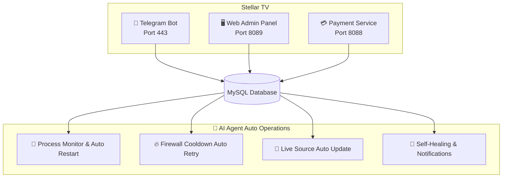

# ⭐ Stellar TV

### Next-Gen Smart IPTV Experience

**No downloads, source code, or copying available. For showcase only.**

**[🇨🇳 中文](README.md) | [🇺🇸 English](README_EN.md)**

---

---

## 📺 About Stellar TV

Stellar TV is an intelligent IPTV service platform based on **Telegram Bot**, providing users with a smooth and high-definition live TV experience. Supporting hundreds of channels including CCTV, satellite TV, local stations, Hong Kong/Macau/Taiwan, and overseas Chinese content, covering all platforms including mobile phones, tablets, computers, and smart TVs.

---

## 🚀 Try It Now

### 👇 Click the link below to experience it directly in Telegram 👇

### 🤖 [@xingcheniptv_bot](https://t.me/xingcheniptv_bot)

**How to get started:**

1. Click the Bot link above or search `@xingcheniptv_bot` in Telegram
2. Click the **Start** button
3. Follow the prompts to complete registration
4. Enjoy free trial of all channels

---

## ✨ Core Features

| Feature | Description |
|:---:|------|
| 🎬 **Massive Channels** | Covering CCTV, satellite TV, local stations, HK/Macau/Taiwan, overseas Chinese with **500+** live sources |
| 📱 **Multi-Platform** | Works on phones, tablets, computers, and smart TVs |
| 🔒 **Secure & Reliable** | End-to-end encryption, privacy data protected |
| ⚡ **Instant Switching** | Millisecond channel switching, zero buffering |
| 🎫 **Flexible Plans** | Monthly / Quarterly / Annual subscriptions |
| 🆓 **Free Trial** | Free trial period for new user registration |
| 📢 **Real-time Announcements** | Important updates pushed instantly via Bot |
| 🤖 **AI Smart Support** | 24/7 automatic response to user inquiries, no manual intervention needed |
| 🔄 **Auto Operations** | AI Agent-driven automated operations, self-healing, high service availability |
| 💳 **Online Payment** | Multiple payment methods supported, instant card activation |
| 🎨 **Custom UI** | Sci-fi themed interface for immersive viewing experience |
| 📊 **Data Analytics** | Admin real-time user data and channel status monitoring |

---

## 🖥️ Admin Panel

Admins can perform the following operations through the web panel:

| Module | Function |
|:---:|------|
| 📊 **Dashboard** | Real-time user data, channel status, revenue statistics |
| 📡 **Channel Management** | Add, edit, delete live channels |
| 📋 **M3U Source Management** | Manage live sources with auto-update support |
| 👥 **User Management** | View user status, enable/disable accounts |
| 🎫 **Card Management** | Generate and manage recharge cards |
| ⚙️ **System Settings** | Configure service parameters |
| 📢 **Announcements** | Edit and push Telegram announcements |

> ⚠️ Admin panel is only available to authorized administrators, not publicly accessible.

---

## 📋 Pricing Plans

| Plan | Price | Description |
|:---:|:---:|------|
| 🆓 **Free Trial** | **¥0** | Experience upon new user registration |
| 📅 **Monthly** | **¥9.9** | 30-day validity |
| 📅 **Quarterly** | **¥25.0** | 90-day validity |
| 📅 **Annual** | **¥88.0** | 365-day validity |

---

## 🏗️ Technical Architecture

### 🛠️ Tech Stack

| Component | Technology |
|:---:|------|
| **Bot Framework** | Python + python-telegram-bot |
| **Web Backend** | Flask / Gunicorn |
| **Database** | MySQL 8.0 |
| **Payment** | Dujiaoka (Auto Card System) |
| **Deployment** | Docker + systemd |
| **Operations** | AI Agent (Xiaomi miclaw + Claude Code) |

---

## 📊 Project Statistics

| Metric | Data |
|:---:|:---:|
| 📺 **Channel Count** | 500+ live sources |
| 👥 **Registered Users** | Growing steadily |
| ⏱️ **Service Availability** | 99%+ |
| 🔄 **Operations Efficiency** | 85% improvement (AI Agent driven) |

---

## 🔐 Copyright Notice

> ⚠️ **Important Notice**
>
> This repository is for project showcase only, **does not provide any**:
>
> - ❌ Source code download
> - ❌ Binary file download
> - ❌ Configuration file download
> - ❌ Docker image download
> - ❌ API access
>
> All code and data are deployed on private servers and not publicly available.
>
> For cooperation or inquiries, please contact the administrator via Telegram.

---

**⭐ Stellar TV — Your Personal TV Butler**

Made with ❤️ by Starchen Team

