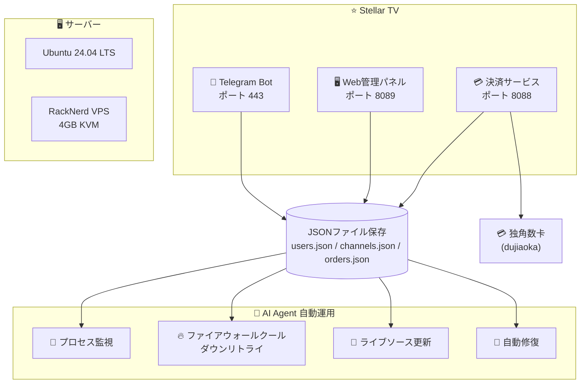

 

# ⭐ Stellar TV（ステラテレビ）

### 📺 次世代スマート IPTV ライブ配信プラットフォーム

 

 

**[🇨🇳 中文](README.md) · [🇺🇸 English](README_EN.md) · [🇹🇼 繁體中文](README_TW.md) · [🇯🇵 日本語](README_JA.md) · [🇰🇷 한국어](README_KO.md)**

 

> ⚠️ 本リポジトリはプロジェクトの紹介専用です。**ダウンロード、ソースコードのコピー、複製は一切提供されません。**

---

## 🚀 今すぐ試す

### 👇 下のボタンをクリックして、Telegram で直接開始 👇

### 🤖 [@xingcheniptv_bot](https://t.me/xingcheniptv_bot)

 

| ステップ | 操作 |
|:---:|------|
| **①** | 上のリンクをクリックするか、Telegram で `@xingcheniptv_bot` を検索 |
| **②** | **開始** ボタンをクリック |
| **③** | 画面の指示に従って登録を完了 |
| **④** | 専用の再生 URL を取得 |

---

## 📺 Stellar TV について

Stellar TV は **Telegram Bot** ベースのスマート IPTV ライブ配信プラットフォームで、スムーズで高画質なライブ視聴体験を用户提供します。

**カバー内容：** CCTV · 衛星放送 · 地方局 · 香港・マカオ・台湾 · 海外中国語 · スポーツ · ニュース · エンタメ

**対応プラットフォーム：** 📱 スマホ · 📱 タブレット · 💻 PC · 📺 スマートTV

---

## ✨ Bot 機能一覧

| 機能 | 説明 |
|:---:|------|
| 📺 **再生URL** | ワンクリックで専用の再生URLを取得、任意のプレーヤーで使用可能 |
| 👤 **マイ情報** | アカウント状態、残り日数、有効期限を確認 |
| 💰 **プラン購入** | 月額 / 四半期 / 年額、柔軟に選択、即時有効 |
| 🎫 **交換カード** | カードコードを入力してプランを有効化 |
| 📢 **ソース失効報告** | チャンネルが再生できない時にワンクリック報告、迅速に修復 |
| 👥 **グループ参加** | 公式 Telegram グループに参加、最新情報とサポートを受ける |
| 📖 **使い方チュートリアル** | 詳細なステップバイステップガイド、初心者でも簡単に使える |
| 🌐 **Webパネル** | Webベースの管理パネル、注文とアカウント情報の確認 |
| ❓ **ヘルプ** | よくある質問とトラブルシューティング、いつでもサポート |

---

## 🖥️ 管理パネル

管理者は Web パネルを通じて以下の操作を行えます：

| モジュール | 機能 |
|:---:|------|
| 📊 **ダッシュボード** | リアルタイムのユーザーデータ、チャンネル状態、収益統計 |
| 📡 **チャンネル管理** | ライブチャンネルの追加、編集、削除 |
| 📋 **M3U ソース** | ライブソースの管理、自動更新対応 |
| ❤️ **ソース監視** | ライブソースの可用性と状態を監視 |
| 👥 **ユーザー管理** | ユーザー状態の確認、アカウントの有効/無効化 |
| 🎫 **交換コード** | 交換コードの生成と管理 |
| 📢 **お知らせ管理** | Telegram お知らせの編集と配信 |
| 📋 **注文管理** | ユーザー注文の確認と管理 |
| 📊 **データ統計** | グループ統計、データ分析レポート |
| ⚙️ **システム設定** | サーバーパラメータの設定 |

> ⚠️ 管理パネルは認証された管理者のみアクセス可能で、一般公開されていません。

---

## 📋 更新履歴

| バージョン | 日付 | 更新内容 |
|:---:|:---:|------|
| **v2.1** | 2026-05-11 | 🔧 注文管理データ構造の修正 · 📊 データ統計モジュールの修正 · 🎨 グループ統計UIの最適化（M3Uカバレッジ色付き、交換コード青緑背景）· 📋 サイドバーのユーザー管理/M3Uソース位置入れ替え |
| **v2.0** | 2026-05-08 | ✨ 管理パネル全面リライト（ユーザーパネル+管理パネル）|
| **v1.0** | 2026-05-07 | 🚀 初回デプロイ |

---

## 📋 料金プラン

| プラン | 料金 | 説明 |
|:---:|:---:|------|
| 🆓 **無料トライアル** | **¥0** | 新規ユーザー登録で3日間体験可能 |
| 📅 **月額プラン** | **¥9.9** | 30日間有効 |
| 📅 **四半期プラン** | **¥25.0** | 90日間有効 |
| 📅 **年額プラン** | **¥88.0** | 365日間有効 |

---

## 🏗️ 技術アーキテクチャ

### 🛠️ 技術スタック

| コンポーネント | 技術 |
|:---:|------|
| **Bot フレームワーク** | Python 3.12 + python-telegram-bot |
| **Web バックエンド** | Flask / Gunicorn |
| **データ保存** | JSONファイル (users.json / channels.json / orders.json) |
| **決済** | 独角数卡 (dujiaoka) + Redis |
| **デプロイ** | Docker + systemd |
| **サーバー** | Ubuntu 24.04 LTS · RackNerd VPS · 4GB RAM |
| **運用** | AI Agent (Xiaomi miclaw) |

---

## 📊 プロジェクトデータ

| 指標 | データ |
|:---:|:---:|
| 📺 **チャンネル数** | 6,346 ライブソース |
| 👥 **登録ユーザー** | 10 |
| 📁 **チャンネルグループ** | 100+ グループ |
| ⏱️ **サービス状態** | 3サービスすべて稼働中 |
| 🖥️ **サーバー** | Ubuntu 24.04 · 4GB RAM · 62GB ディスク |
| 🤖 **AI運用** | Xiaomi miclaw 完全自動管理 |

### 📡 チャンネルグループ統計（Top 15）

| グループ | 数 | グループ | 数 |
|:---:|:---:|:---:|:---:|
| 📰 News | 800 | 🎵 Music | 595 |
| 🎭 Entertainment | 562 | 🎬 Movies | 357 |
| ⚽ Sports | 295 | 📡 衛星チャンネル | 172 |
| 📚 Education | 192 | 🧒 Kids | 167 |
| ☘️ 浙江チャンネル | 144 | 🌍 Documentary | 112 |
| 📺 CCTV | 109 | 🎭 Culture | 104 |
| 🎬 映画チャンネル | 84 | 🏀 スポーツチャンネル | 76 |
| 🌊 香港·澳門·台湾 | 50 | | |

---

## 🔐 著作権表示

> ⚠️ **重要な免責事項**
>
> 本リポジトリはプロジェクトの紹専用です。**以下は一切提供されません**：
>
> - ❌ ソースコードのダウンロード
> - ❌ バイナリファイルのダウンロード
> - ❌ 設定ファイルのダウンロード
> - ❌ Docker イメージのダウンロード
> - ❌ API インターフェースへのアクセス
>
> すべてのコードとデータはプライベートサーバーにデプロイされており、公開されていません。
>
> ご協力やお問い合わせは、Telegram で管理者にお問い合わせください。

---

**⭐ Stellar TV — あなたの専用テレビ管家**

Made with ❤️ by Starchen Team

