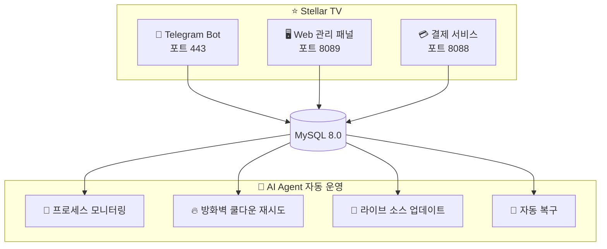

 

# ⭐ Stellar TV (스텔라 TV)

### 📺 차세대 스마트 IPTV 라이브 스트리밍 플랫폼

 

 

**[🇨🇳 中文](README.md) · [🇺🇸 English](README_EN.md) · [🇹🇼 繁體中文](README_TW.md) · [🇯🇵 日本語](README_JA.md) · [🇰🇷 한국어](README_KO.md)**

 

> ⚠️ 이 저장소는 프로젝트 전시용입니다. **다운로드, 소스 코드 복사 또는 복제는 제공되지 않습니다.**

---

## 🚀 지금 바로 시작하기

### 👇 아래 버튼을 클릭하여 Telegram에서 바로 시작 👇

### 🤖 [@xingcheniptv_bot](https://t.me/xingcheniptv_bot)

 

| 단계 |操作 |
|:---:|------|
| **①** | 위 링크를 클릭하거나 Telegram에서 `@xingcheniptv_bot` 검색 |
| **②** | **시작** 버튼 클릭 |
| **③** | 화면 안내에 따라 회원가입 완료 |
| **④** | 전용 재생 URL 획득 |

---

## 📺 Stellar TV 소개

Stellar TV는 **Telegram Bot** 기반의 지능형 IPTV 라이브 스트리밍 플랫폼으로, 원활하고 고화질의 라이브 시청 경험을 제공합니다.

**콘텐츠 범위:** CCTV · 위성방송 · 지방방송 · 홍콩/마카오/대만 · 해외 중국어 · 스포츠 · 뉴스 · 엔터테인먼트

**지원 플랫폼:** 📱 스마트폰 · 📱 태블릿 · 💻 PC · 📺 스마트TV

---

## ✨ Bot 기능一览

| 기능 | 설명 |
|:---:|------|
| 📺 **재생 URL** | 원클릭으로 전용 재생 URL 획득, 모든 플레이어에서 사용 가능 |
| 👤 **내 정보** | 계정 상태, 남은 일수, 만료일 확인 |
| 💰 **플랜 구매** | 월간 / 분기 / 연간, 유연한 선택, 즉시 적용 |
| 🎫 **교환 카드** | 카드 코드 입력으로 플랜 활성화 |
| 📢 **소스 만료 보고** | 채널 재생 불가 시 원클릭 보고, 빠른 수정 |
| 👥 **그룹 참여** | 공식 Telegram 그룹에 참여, 최신 소식과 지원 받기 |
| 📖 **사용법 튜토리얼** | 상세한 단계별 가이드, 초보자도 쉽게 사용 가능 |
| 🌐 **웹 패널** | 웹 기반 관리 패널, 주문 및 계정 정보 확인 |
| ❓ **도움말** | 자주 묻는 문제와 문제 해결, 언제든지 지원 |

---

## 🖥️ 관리 패널

관리자는 웹 패널을 통해 다음 작업을 수행할 수 있습니다:

| 모듈 | 기능 |
|:---:|------|
| 📊 **대시보드** | 실시간 사용자 데이터, 채널 상태, 수익 통계 |
| 📡 **채널 관리** | 라이브 채널 추가, 편집, 삭제 |
| 📋 **M3U 소스** | 라이브 소스 관리, 자동 업데이트 지원 |
| ❤️ **소스 모니터** | 라이브 소스 가용성 및 상태 모니터링 |
| 👥 **사용자 관리** | 사용자 상태 확인, 계정 활성화/비활성화 |
| 🎫 **교환 코드** | 교환 코드 생성 및 관리 |
| 📢 **공지 관리** | Telegram 공지 편집 및 전송 |
| 📋 **주문 관리** | 사용자 주문 조회 및 관리 |
| 📊 **데이터 통계** | 그룹 통계, 데이터 분석 리포트 |
| ⚙️ **시스템 설정** | 서비스 매개변수 구성 |

> ⚠️ 관리 패널은 인증된 관리자만 접근 가능하며, 공개되지 않습니다.

---

## 📋 업데이트 기록

| 버전 | 날짜 | 업데이트 내용 |
|:---:|:---:|------|
| **v2.1** | 2026-05-11 | 🔧 주문 관리 데이터 구조 수정 · 📊 데이터 통계 모듈 수정 · 🎨 그룹 통계 UI 최적화 (M3U 컬러리지 색상 표시, 교환코드 파란초록 배경) · 📋 사이드바 사용자 관리/M3U 소스 위치 교체 |
| **v2.0** | 2026-05-08 | ✨ 관리 패널 전체 리라이트 (사용자 패널+관리 패널) |
| **v1.0** | 2026-05-07 | 🚀 최초 배포 |

---

## 📋 요금제

| 플랜 | 가격 | 설명 |
|:---:|:---:|------|
| 🆓 **무료 체험** | **¥0** | 신규 회원가입 시 체험 가능 |
| 📅 **월간 플랜** | **¥9.9** | 30일 유효 |
| 📅 **분기 플랜** | **¥25.0** | 90일 유효 |
| 📅 **연간 플랜** | **¥88.0** | 365일 유효 |

---

## 🏗️ 기술 아키텍처

### 🛠️ 기술 스택

| 구성 요소 | 기술 |
|:---:|------|
| **Bot 프레임워크** | Python + python-telegram-bot |
| **Web 백엔드** | Flask / Gunicorn |
| **데이터베이스** | MySQL 8.0 |
| **결제** | 独角数卡 (dujiaoka) |
| **배포** | Docker + systemd |
| **운영** | AI Agent (Xiaomi miclaw + Claude Code) |

---

## 📊 프로젝트 데이터

| 지표 | 데이터 |
|:---:|:---:|
| 📺 **채널 수** | 500+ 라이브 소스 |
| 👥 **가입 사용자** | 지속적 증가 중 |
| ⏱️ **서비스 가용성** | 99%+ |
| 🔄 **운영 효율** | 85% 향상 (AI Agent 기반) |

---

## 🔐 저작권 고지

> ⚠️ **중요 면책 조항**
>
> 이 저장소는 프로젝트 전시용입니다. **다음은 제공되지 않습니다**:
>
> - ❌ 소스 코드 다운로드
> - ❌ 바이너리 파일 다운로드
> - ❌ 설정 파일 다운로드
> - ❌ Docker 이미지 다운로드
> - ❌ API 인터페이스 접근
>
> 모든 코드와 데이터는 프라이빗 서버에 배포되어 공개되지 않습니다.
>
> 협력이나 문의가 필요하시면 Telegram으로 관리자에게 연락해 주세요.

---

**⭐ Stellar TV — 당신의 전용 TV 집사**

Made with ❤️ by Starchen Team

