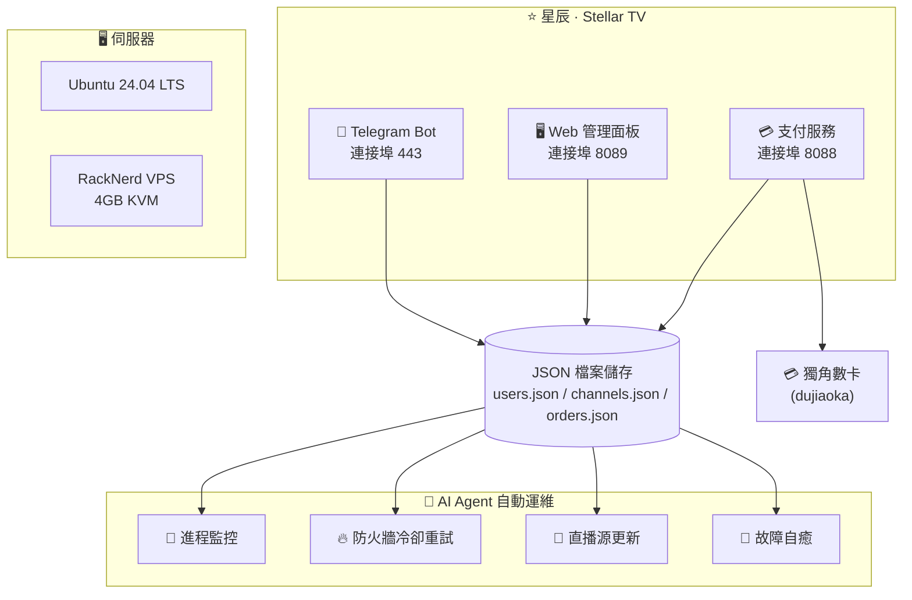

 

# ⭐ 星辰 · Stellar TV

### 📺 下一代智能 IPTV 影視直播平台

 

 

**[🇨🇳 简体中文](README.md) · [🇺🇸 English](README_EN.md) · [🇹🇼 繁體中文](README_TW.md) · [🇯🇵 日本語](README_JA.md) · [🇰🇷 한국어](README_KO.md)**

 

> ⚠️ 本倉庫僅供項目展示，**不提供任何下載、原始碼拷貝或複製**。

---

## 🚀 立即體驗

### 👇 點擊下方按鈕，直接在 Telegram 中開啟 👇

### 🤖 [@xingcheniptv_bot](https://t.me/xingcheniptv_bot)

 

| 步驟 | 操作 |
|:---:|------|
| **①** | 點擊上方連結或在 Telegram 搜尋 `@xingcheniptv_bot` |
| **②** | 點擊 **開始** 按鈕 |
| **③** | 按提示完成註冊 |
| **④** | 即可獲取自己的專屬播放位址 |

---

## 📺 關於星辰 · Stellar TV

星辰 · Stellar TV 是一款基於 **Telegram Bot** 的智能 IPTV 影視直播平台，為用戶提供流暢、高清的直播觀看體驗。

**覆蓋內容：** 央視 · 衛視 · 地方台 · 港澳台 · 海外華語 · 體育 · 新聞 · 娛樂

**支援平台：** 📱 手機 · 📱 平板 · 💻 電腦 · 📺 智慧電視

---

## ✨ Bot 功能一覽

| 功能 | 說明 |
|:---:|------|
| 📺 **播放位址** | 一鍵獲取專屬播放位址，支援複製到任意播放器使用 |
| 👤 **我的資訊** | 查看帳號狀態、剩餘天數、到期時間 |
| 💰 **購買套餐** | 月卡 / 季卡 / 年卡，靈活選擇，即時生效 |
| 🎫 **使用兌換卡** | 輸入卡密即可啟動套餐 |
| 📢 **源失效上報** | 頻道無法播放時一鍵上報，快速修復 |
| 👥 **加入群組** | 加入官方 Telegram 群組，獲取最新動態和幫助 |
| 📖 **使用教程** | 詳細的圖文教程，新手也能快速上手 |
| 🌐 **網頁面板** | 網頁端管理面板，查看訂單和帳號資訊 |
| ❓ **使用幫助** | 常見問題解答，遇到問題隨時查看 |

---

## 🖥️ 管理面板

管理員可透過 Web 面板進行以下操作：

| 模組 | 功能 |
|:---:|------|
| 📊 **儀錶板** | 即時查看用戶數據、頻道狀態、收入統計 |
| 📡 **頻道管理** | 新增、編輯、刪除直播頻道 |
| 📋 **M3U 源** | 管理直播源，支援自動更新 |
| ❤️ **源監控** | 監控直播源可用性和狀態 |
| 👥 **用戶管理** | 查看用戶狀態、啟用/停用帳號 |
| 🎫 **兌換卡** | 產生和管理兌換卡密 |
| 📢 **公告管理** | 編輯和推送 Telegram 公告 |
| 📋 **訂單管理** | 查看和管理用戶訂單 |
| 📊 **數據統計** | 分組統計、數據分析報表 |
| ⚙️ **系統設定** | 設定服務參數 |

> ⚠️ 管理面板僅對授權管理員開放，不對外提供存取。

---

## 📋 更新日誌

| 版本 | 日期 | 更新內容 |
|:---:|:---:|------|
| **v2.1** | 2026-05-11 | 🔧 修復訂單管理資料結構 · 📊 修復資料統計模組 · 🎨 優化分組統計介面（M3U覆蓋率帶顏色、兌換碼藍綠背景）· 📋 側邊欄使用者管理/M3U源位置對調 |
| **v2.0** | 2026-05-08 | ✨ 管理面板全面重寫（前台使用者面板+後台管理面板）|
| **v1.0** | 2026-05-07 | 🚀 首次部署上線 |

---

## 📋 套餐價格

| 套餐 | 價格 | 說明 |
|:---:|:---:|------|
| 🆓 **免費試用** | **¥0** | 新用戶註冊即可體驗，3天有效期 |
| 📅 **月卡** | **¥9.9** | 30天有效期 |
| 📅 **季卡** | **¥25.0** | 90天有效期 |
| 📅 **年卡** | **¥88.0** | 365天有效期 |

---

## 🏗️ 技術架構

### 🛠️ 技術棧

| 組件 | 技術 |
|:---:|------|
| **Bot 框架** | Python 3.12 + python-telegram-bot |
| **Web 後端** | Flask / Gunicorn |
| **資料儲存** | JSON 檔案 (users.json / channels.json / orders.json) |
| **支付** | 獨角數卡 (dujiaoka) + Redis |
| **部署** | Docker + systemd |
| **伺服器** | Ubuntu 24.04 LTS · RackNerd VPS · 4GB RAM |
| **運維** | AI Agent (Xiaomi miclaw) |

---

## 📊 專案數據

| 指標 | 數據 |
|:---:|:---:|
| 📺 **頻道數量** | 6,346 個直播源 |
| 📁 **頻道分組** | 100+ 個分組 |
| ⏱️ **服務狀態** | 三個服務全部運行中 |
| 🖥️ **伺服器** | Ubuntu 24.04 · 4GB RAM · 62GB 磁碟 |
| 🤖 **AI 運維** | Xiaomi miclaw 全自動管理 |

### 📡 頻道分組統計（Top 15）

| 分組 | 數量 | 分組 | 數量 |
|:---:|:---:|:---:|:---:|
| 📰 News | 800 | 🎵 Music | 595 |
| 🎭 Entertainment | 562 | 🎬 Movies | 357 |
| ⚽ Sports | 295 | 📡 衛視頻道 | 172 |
| 📚 Education | 192 | 🧒 Kids | 167 |
| ☘️ 浙江頻道 | 144 | 🌍 Documentary | 112 |
| 📺 央視頻道 | 109 | 🎭 Culture | 104 |
| 🎬 電影頻道 | 84 | 🏀 體育頻道 | 76 |
| 🌊 港·澳·台 | 50 | | |

---

## 🔐 版權聲明

> ⚠️ **重要聲明**
>
> 本倉庫僅供項目展示，**不提供任何**：
>
> - ❌ 原始碼下載
> - ❌ 二進位檔案下載
> - ❌ 設定檔案下載
> - ❌ Docker 映像下載
> - ❌ API 介面存取
>
> 所有程式碼和數據均部署在私有伺服器上，不對外公開。
>
> 如需合作或諮詢，請透過 Telegram 聯繫管理員。

---

**⭐ 星辰 · Stellar TV — 您的私人電視管家**

Made with ❤️ by Starchen Team

